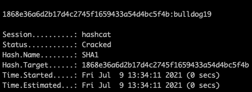

# Mustacchio CTF [TryHackMe](https://tryhackme.com/room/mustacchio)


---

```bash
$ export IP=10.10.203.61
```

---

### Enumeration

```bash
$ nmap -sC -sV -v $IP -oN nmap/initial.nmap

$ gobuster dir -t 64 -u $IP -w ~/wordlists/website_dir/directory-list-2.3-medium.txt -x .txt,.php,.html,.jpg,.png -o gobuster/dir_med_initial.txt
```

Ports:
```
22 ssh
80 http
```

Checking out the landing page of the website, I notice that there is some directory named `custom` and accessing `js` in that directory leads to a file `users.bak` and when running strings through it, it is evident that this is some sort of SQLite Configuration with a user `admin` and their password hash.

Running the hash through hashid it indicates `SHA-1` and this is confirmed when hashcat quickly cracks it using the following command:

```bash
$ hashcat -m 100 '1868e36a6d2b17d4c2745f1659433a54d4bc5f4b' ~/wordlists/passwords/rockyou.txt
```



We now have a password for some sort of a database
`admin:bulldog19`

I couldn't find anything of value, tried a bit of SQL injection and php trickhousery in the cookie panels but nothing was really working for me. I then fired up nmap again to check all ports in case there was something I had missed from my previous scan

```bash
$ nmap -p- -T5 -v $IP -oN nmap/all_ports.nmap
```

---

### Finding access to the machine

And we find a new port: `8765` which is named as being `ultraseek-http`.
And viola! We have some sort of admin sign-in page and using the credentials we got earlier, we can now access the admin page.

We have some sort of xml we can input in the comment section of the admin page. If we take a look at the source code, it points to something about barry's ssh keys (something we can probably nick with XXE) and an example for the xml. Using a simple payload file for xml, we can now access files from the machine.
Critically we want to access his ssh key, located typically in `/home/<<USER>>/.ssh/id_rsa`, and using this path, we find barry's ssh key!
But it is passphrase protected...
No matter, it is time for JtR
First we generate a hash for JtR using `ssh2john`

```bash
$ ssh2john.py id_rsa > id_rsa.hash
# Followed by:
$ john -wordlist=~/wordlists/passwords/rockyou.txt id_rsa.hash
```

And we manage to crack the hash! `urieljames`!
It's also important to note that you _could not_ brute force it with hydra, as the machine cannot be accessed with barry's machine password.

I also did access the `user.txt` flag using the xml exploit just to spare me from swapping out of the terminal to the broswer.

---

### Priviledge Escalation

Onwards to privesc. I initially tried to load linpeas.sh onto the machine but it just was not playing nice, so I decided to do it _manually_, bleugh.
So I kick off with the easiest (and thankfully correct) option of trying to locate SUIDs.

```bash
$ find / -perm -4000 -type f -exec ls -la {} 2>/dev/null \;
```

Looking at the results of this, I notice a strange (custom binary) that is owned by root but executable by anyone located in joe's home directory.
Running strings through it, I notice that `tails` is being executed without its absolute path.
It is time for a PATH exploit!
I first navigate back to my home directory and write a script named `tails`

```bash
#!/bin/bash

cat /root/root.txt > /home/barry/root.txt
```
Ordinarily, you would want to become the root user but I was not in the mood ;). So instead I copied the root flag over to my directory for ease of viewing.
Remembering to make it executable by

```bash
$ chmod +x tails
# Now add it to PATH for priority
$ export PATH="$(pwd):$PATH"
```

And we now have the root flag!

**_Complete!_**


