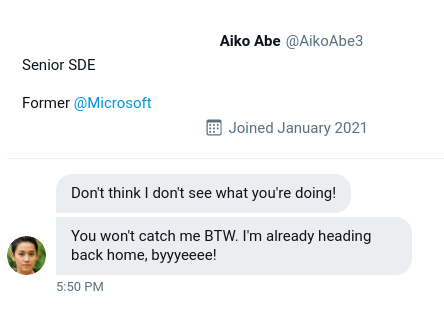
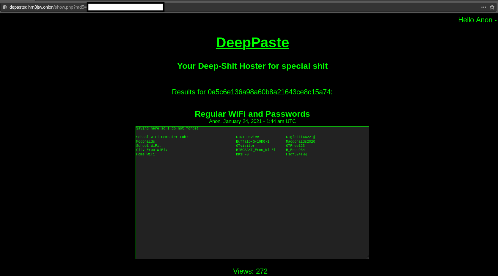

# Sakura OSint [TryHackMe](https://tryhackme.com/room/sakura)


---


---

## Index
- [TIP-OFF](#tip-off)
- [RECONNAISSANCE](#reconnaissance)
- [UNVEIL](#unveil)
- [TAUNT](#taunt)
- [HOMEBOUND](#homebound)
- [Final Thoughts](#final-thoughts)

---

### TIP-OFF


Notice that this is an `svg` file hosted on GitHub.
Examining the contents of the`svg` file, we discover an interesting directory:

```xml
inkscape:version="0.92.5 (2060ec1f9f, 2020-04-08)"
sodipodi:docname="pwnedletter.svg"
inkscape:export-filename="/home/SakuraSnowAngelAiko/Desktop/pwnedletter.png"
inkscape:export-xdpi="96"
inkscape:export-ydpi="96">>
```

`SakuraSnowAngelAiko`

We have a username!

---

### RECONNAISSANCE

Googling `SakuraSnowAngelAiko` we immediately find two items of interest: a GitHub profile and a Linkedin profile.

The Linkedin page reveals their name to be: `Aiko Abe`

To find their email address, we check their GitHub page out: on it we find a PGP key of some sort.

Grabbing that and blindly throwing it in reveals:

```bash
gpg publickey
# gpg: WARNING: no command supplied.  Trying to guess what you mean ...
```
```
pub   rsa3072 2021-01-23 [SC] [expires: 2023-01-22]
      A6519F273BF88E9126B0F4C5ECDD0FD294110450
uid           SakuraSnowAngel83@protonmail.com
sub   rsa3072 2021-01-23 [E] [expires: 2023-01-22]
```

`SakuraSnowAngel83@protonmail.com`

---

### UNVEIL

Checking out their GitHub profile out a bit more, they seem to have some sort of mining wallet hosted their: potentially revealing credentials in the git history of the repo.

`Ethereum` wallet

And checking their git history (of 2 commits wink, wink) reveals their cryptocurrency wallet information.

```
0xa102397dbeeBeFD8cD2F73A89122fCdB53abB6ef
```

We can google that address and it reveals a transaction history for that address converting `Ethereum` to `Tether`.

We can check the Ethereum page to reveal that the attacker received a payment from the pool `Ethermine` as well

---

### TAUNT

```
Just as we thought, the cybercriminal is fully aware that we are gathering information about them after their attack. They were even so brazen as to message the OSINT Dojo on Twitter and taunt us for our efforts.
```



Hilarious

Going onto Twitter (works if you have an account) and googling `AikoAbe3` reveals a new account with the handle `SakuraLoverAiko`

They have, brazenly, revealed the details of their WiFi

```
http://depastedihrn3jtw.onion/show.php?md5=0a5c6e136a98a60b8a21643ce8c15a74
```



Hosts the details for the WiFi networks they have noted down.

Using [Wigle](https://wigle.net) and doing an Advanced Scan for the SSID of their home network `DK1F-G` reveals one result for it with the BSSID of `84:AF:EC:34:FC:F8`. We'll come back to the map location of it in just a bit.

---

### HOMEBOUND

Checking their tweets prior to them leaving for their flight - we can see that the Washington Monument is in the background of the picture. Checking for airports in and around Washington DC/Monument, there is Washington Dulles International Airport: `DCA`.

We can also see them labelling a picture as home as well as other pictures of cherry blossoms.

They are presumably then in Japan and their lounge picture indicates `JAL` lounge Sakura.

A bit of googling reveals that this is most likely Tokyo Airport Haneda: `HND`

Now checking Google Earth and using that stray island thing in the distance to align overselves, we can find that the lake is `Lake Inawashiro`.

Remember from earlier about the map location of the SSID/BSSID? That will reveal their home location.

The map in wigle covers the name of the city closest to their name and I can barely see what is written on their map. Going back to Google Maps, we can triangulate the city with the three visible cities on wigle as `Hirosaki`

---

### Final Thoughts

And we are done! A really fun room that shows the power of OSint and how easily public information can be leveraged.


